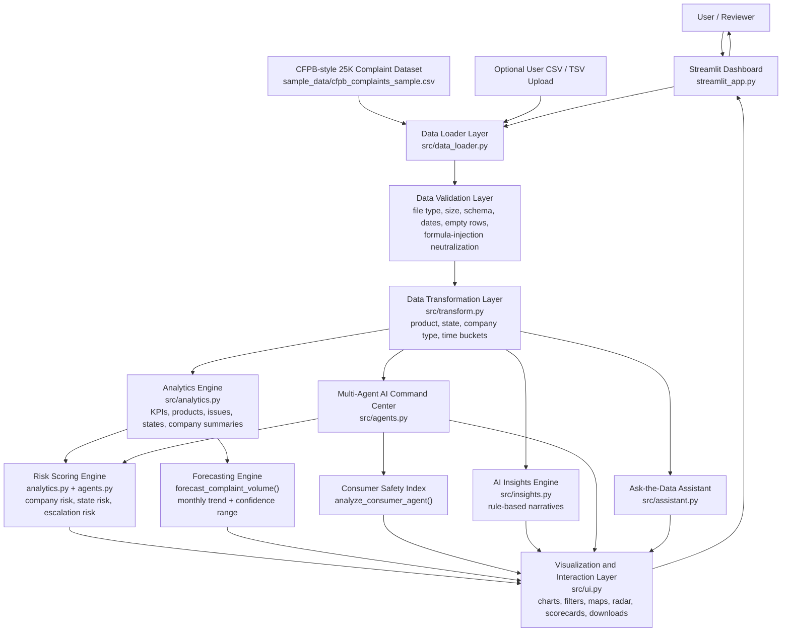
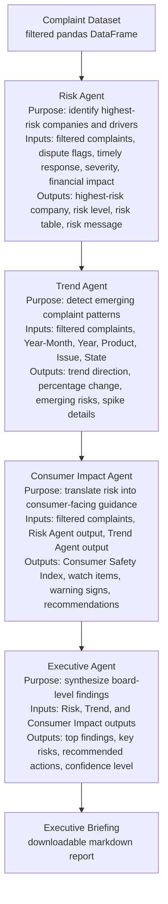
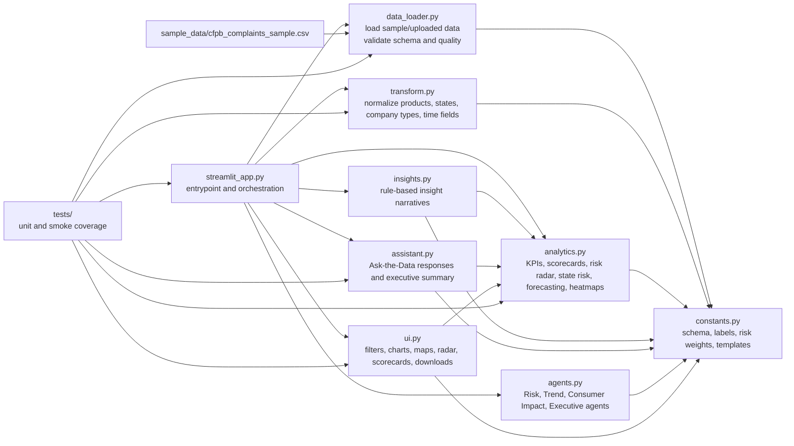
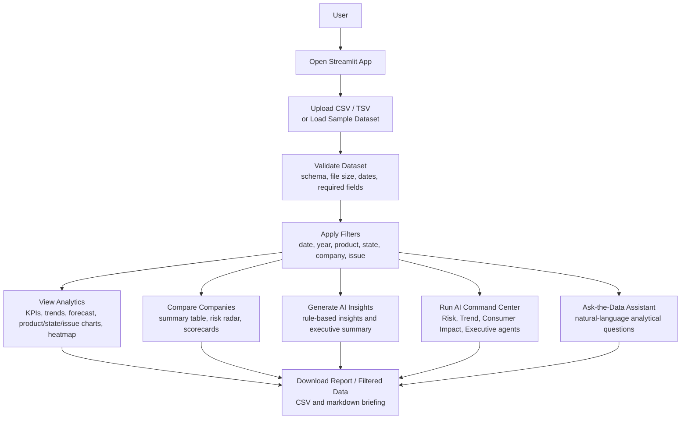

# Consumer Finance Risk Radar Architecture Diagrams

Professional Mermaid diagrams for the Consumer Finance Risk Radar project documentation, GitHub README, Mermaid Live Editor, Draw.io, Excalidraw, and Lucidchart workflows.

## Implementation Mapping

The requested architecture names `risk_scoring.py` and `visualizations.py` as conceptual components. In the current codebase, those responsibilities are implemented as:

- Risk scoring: `src/analytics.py` for risk radar, state risk, scorecards, and forecasting inputs; `src/agents.py` for AI Command Center risk scoring.
- Visualizations: `src/ui.py` for charts, maps, radar chart, scorecards, filters, downloads, and Streamlit UI rendering.

## 1. Solution Architecture Diagram

### Description
This diagram shows the end-to-end platform architecture from the bundled CFPB-style 25K complaint dataset and optional CSV upload through validation, transformation, analytics, AI insights, and Streamlit presentation.

### Business Purpose
It communicates that Consumer Finance Risk Radar is not just a dashboard; it is a complete consumer-risk intelligence pipeline that turns raw complaints into explainable metrics, forecasts, AI briefings, and user-facing decision support.

### Technical Explanation
`streamlit_app.py` orchestrates the workflow. `src/data_loader.py` reads and validates data, `src/transform.py` standardizes fields, `src/analytics.py` computes metrics and forecasts, `src/insights.py` generates narrative insights, `src/agents.py` powers the multi-agent command center, `src/assistant.py` answers natural-language questions, and `src/ui.py` renders the Streamlit experience.

### Mermaid

## 2. Multi-Agent AI Workflow Diagram

### Description
This diagram shows the deterministic multi-agent analysis sequence used by the AI Command Center.

### Business Purpose
It helps judges and recruiters understand how the platform turns filtered complaints into an executive-ready briefing without external API keys or non-deterministic model calls.

### Technical Explanation
The command center uses functions in `src/agents.py`. The app runs the Risk Agent, then Trend Agent, then Consumer Impact Agent, then Executive Agent. The briefing is created by `build_briefing_markdown()`.

### Mermaid

## 3. Component Interaction Diagram

### Description
This diagram maps the actual Python files and how they interact inside the Streamlit application.

### Business Purpose
It gives reviewers a fast technical overview of project structure and maintainability.

### Technical Explanation
The app is intentionally modular. The entrypoint coordinates loading, transformation, filtering, analytics, assistant responses, agent workflows, and UI rendering. There are no separate `risk_scoring.py` or `visualizations.py` files; those responsibilities are implemented in `analytics.py`, `agents.py`, and `ui.py`.

### Mermaid

## 4. User Workflow Diagram

### Description
This diagram shows the user journey from opening the app to exporting insights.

### Business Purpose
It frames the project as a practical workflow for analysts, founders, consumer advocates, and demo reviewers.

### Technical Explanation
Users can start with the sample dataset or upload a validated CSV/TSV. Filters drive all downstream tabs. Analytics, AI insights, command-center outputs, assistant responses, and downloads all operate on the current filtered dataset.

### Mermaid

## PNG-Ready Rendering

Each Mermaid block above can be rendered directly as PNG or SVG using:

- GitHub Markdown preview
- Mermaid Live Editor
- Draw.io Mermaid import
- Lucidchart Mermaid import
- Excalidraw Mermaid-to-Excalidraw workflows

Recommended export settings:

- Format: PNG for submissions, SVG for crisp README/docs rendering
- Theme: default or neutral
- Background: white
- Width: 1600 px or higher for slide decks

## Recommended Diagrams for Week 1 Submission

Use these two diagrams for the strongest first impression:

1. **Solution Architecture Diagram**: best for judges because it shows the full system, data flow, AI features, and technical maturity in one view.
2. **Multi-Agent AI Workflow Diagram**: best for recruiters because it clearly explains the AI Command Center and makes the project feel differentiated, deterministic, and demo-ready.

