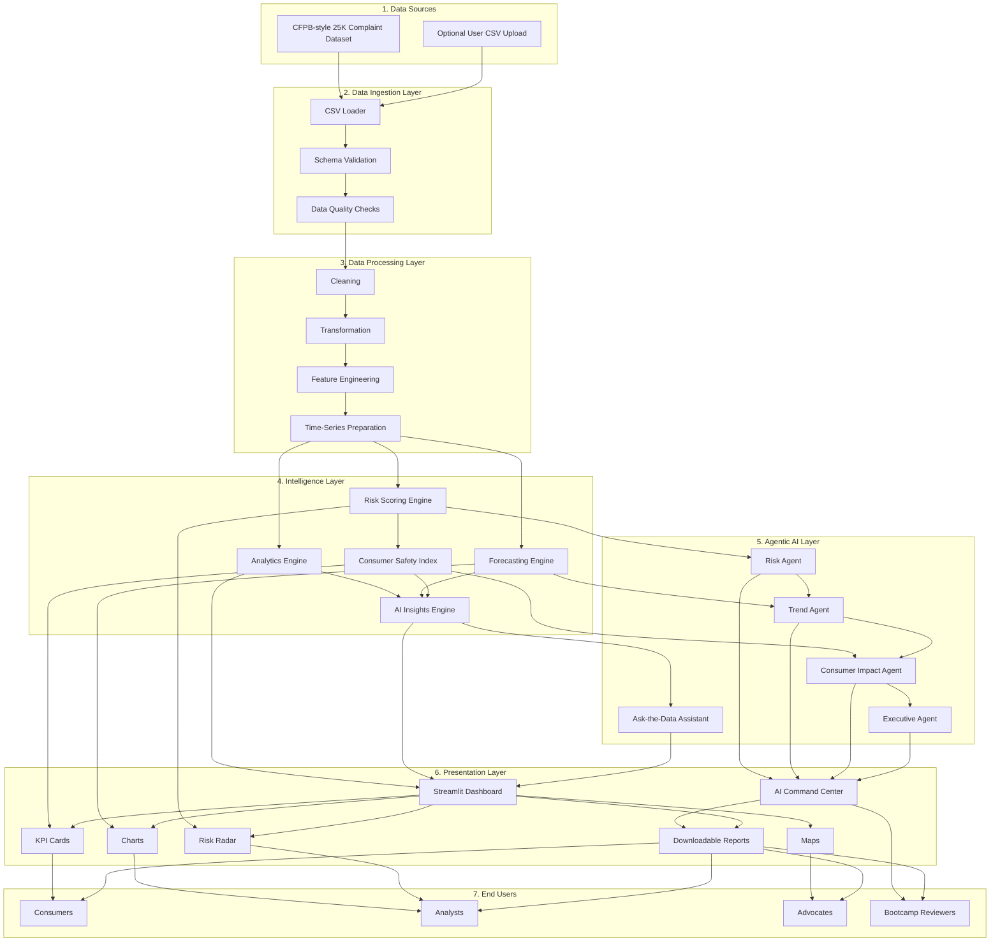

# High-Level System Architecture - Consumer Finance Risk Radar

This document provides a business/product-level architecture view of Consumer Finance Risk Radar. It is designed for Week 1 project documentation, GitHub, Mermaid Live Editor, and presentation exports.

## Diagram

## Short Explanation

This architecture shows Consumer Finance Risk Radar as a layered intelligence platform. Complaint data enters through either the bundled CFPB-style sample dataset or an optional user upload. The data is validated, cleaned, transformed, and prepared for analytics. The intelligence layer produces risk scores, forecasts, Consumer Safety Index signals, and rule-based insights. The agentic AI layer turns those signals into risk, trend, consumer impact, executive, and natural-language assistant outputs. The Streamlit presentation layer converts the analysis into dashboard views, KPI cards, charts, maps, risk radar, AI Command Center briefings, and downloadable reports for consumers, analysts, advocates, and bootcamp reviewers.

## Google Doc Paragraph

Consumer Finance Risk Radar is organized as a layered consumer-risk intelligence platform. CFPB-style complaint data flows through ingestion, validation, cleaning, transformation, and time-series preparation before reaching the intelligence layer, where the system calculates analytics, risk scores, forecasts, Consumer Safety Index signals, and AI-generated insights. A deterministic agentic AI layer then converts those signals into Risk Agent, Trend Agent, Consumer Impact Agent, Executive Agent, and Ask-the-Data Assistant outputs. Finally, the Streamlit presentation layer delivers KPI cards, charts, maps, risk radar, an AI Command Center, and downloadable reports for consumers, analysts, advocates, and bootcamp reviewers.

## How to Render in Mermaid Live Editor

1. Open [Mermaid Live Editor](https://mermaid.live/).
2. Copy only the Mermaid code block from the **Diagram** section above.
3. Paste it into the editor panel.
4. Choose a clean theme such as `default`, `base`, or `neutral`.
5. Export as PNG or SVG for your Week 1 submission, README assets, or presentation slides.

